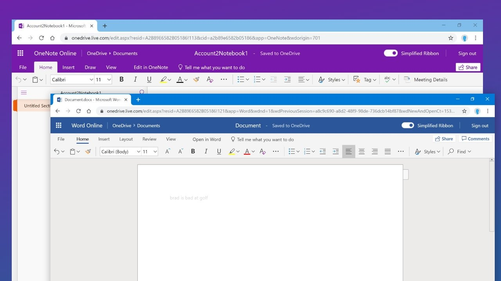
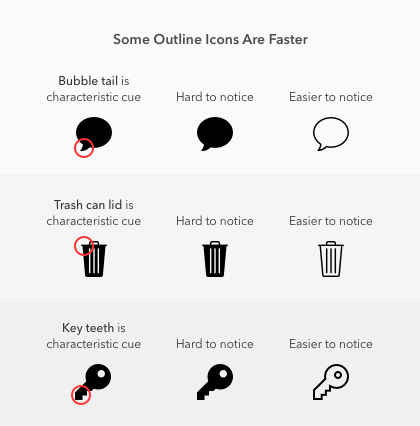
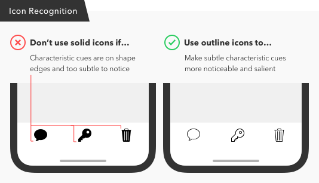
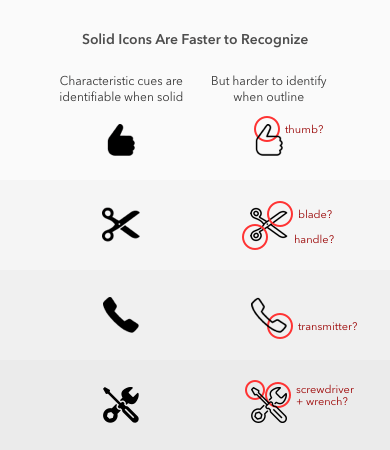

Today is more of an exploration of iconography. Iconography is my latest new hobby, 📘 learning more on iconography, 🔍 identifying the 💭 thought process behind the creation of icons, what to consider while creating icons, how to ensure their consistency etc. 

My Colleague, Dinesha Kumar was more than happy to take an hour of class on iconography and pictorials and set the direction 🎯. It's an honour to have a great mentor who could shed light in these areas throughout the journey. 

Icons are lifesavers in this world of noise and worthless information. You only need a quick look at an icon to get the complex message it carries. Icons unite the entire world 🌐. It doesn’t matter what language you speak – the one visual language of icons speaks louder 📢 than any words can.

There are different types of icons based on their styles

1. Outline icons
2. Filled icons
3. Glyph icons
4. Flat icons
5. Hand drawn icons
6. Skewmorphic icons

Outline icons are one of my favourites 💖, I admire what Microsoft does with their iconography. These are well thought out, clean iconography. 

> Creating one beautiful icon is easy. Creating a few good looking icons isn’t that hard either. It’s making them cohesive that can knock you down.

I was thinking that the outline icons and filled icons are just a matter of user preference and adds to aesthetics only but looks like there's much more than that. It's picked based on the speed at which you can grasp the characteristic cues in the icon. The image below show's it better.

More on that. 

There are scenarios when solid icons are faster, that is when the icons represent physical objects in the real world. Viewing them in solid icons would give a much more realastic approach. 

So choosing whether to go with outline icons or filled icons can only be done based on the concept of the app and what suits better. When choosing icons, it’s best to stick to a consistent style. Instead of mixing solid and outline styles, try to choose a set of icons that have salient characteristic cues with sharper angles that point outward.

For more info visit - [UXMovement | Solid Vs. Outline Icons: Which Are Faster to Recognize?](https://uxmovement.com/mobile/solid-vs-outline-icons-which-are-faster-to-recognize/)

### So coming back to icons. How can we make it better?

1. Keep The Same Stylistics
2. Size Matters! - Stick to same size
3. Try Using Grids
4. Use The Same Color Palette

*This is where i've reached so far. Will keep posted on my readings on iconography.*

If you're starting a new project and don't want to go through all these troubles of creating consistent, clean icons, we have a solution in front us, Don't re-invent the wheel unless necessary. There are lots of icon providers

1. IconFinder - 4,438,576 icons
2. NounProject - Over 2 Million curated icons
3. Flat icon - 2,876,500 Icons
4. Icon8 - 129,200 FREE ICONS

Adios for the day 👋