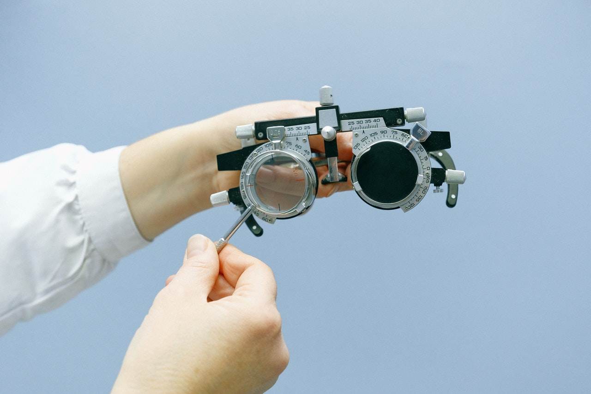

So when we talk about the types of disabilities, what are we talking about. what do we have to consider to make the web accessible for everyone? There are five main areas of disability that affect our use of the web. Visual impairments, Auditory impairments, Motor impairments, Cognitive impairments, and vestibular disorders and seizures. This post will be mostly about visual impairments.

## Visual Impairments

These are the impairments and disabilities related to the eyes, can be anything from nearsightedness, loss of power, colour blindness or anything.

### Colour blindness

Colour blindness is a rather common impairment that causes you to see colours slightly different from what they actually are. There are different types of colour blindness, Let's not get into medical terms, instead to simplify let's say that there are three basic types.

1. Red-green colour blindness (Difficulty in distinguishing red and green)
2. Blue-yellow colour blindness (Difficulty in distinguishing blue and yellow)
3. Complete colour blindness

#### 💡 What can we do to make web accessible for people with colour blindness?

There's a lot that has to be done to make the web accessible for this case

1. Avoid certain colour combinations (Like green & black, blue and grey, green and grey, etc) For more info you can check [We are Colourblind - Making the world a better place for the colourblind](https://wearecolourblind.com/)
2. Try viewing your app or website in monochrome and see what all details you're not able to distinguish. Viewing your website in greyscale mode helps you envisage how it would appear to your colour-blind audience+
3. Use icons or symbols along with colours for conveying a message, like how we alert a user that something is not correct, etc

#### 📚 Here are some resources if you're interested

1. [https://www.usability.gov/get-involved/blog/2010/02/colour-blindness.html](https://www.usability.gov/get-involved/blog/2010/02/colour-blindness.html)
2. [https://www.designmantic.com/community/website-design-guide-colour-blind.php](https://www.designmantic.com/community/website-design-guide-colour-blind.php)
3. [https://jfly.uni-koeln.de/colour/](https://jfly.uni-koeln.de/colour/)
4. [https://docs.microsoft.com/en-us/previous-versions/windows/internet-explorer/ie-developer/accessibility/gg701983(v%3Dvs.85)](https://docs.microsoft.com/en-us/previous-versions/windows/internet-explorer/ie-developer/accessibility/gg701983%28v%3dvs.85%29)

### Eyesight loss

Apart from colour blindness, there can be other issues where his vision is reduced, either age-related or due to any other diseases, where the vision is blurred or obscured. Nearsightedness and farsightedness can also be included here.

#### 💡 What can we do to make web accessible for them?

1. Make text more legible, for that use actual fonts rather than using them in images (This will help with magnifiers too)
2. Clear labels for the input fields, and information.
3. Have better contrast ratios for the text vs background. (WCAG 2.1 AAA - Text and images of text have a 7:1 minimum contrast ratio.)

#### 📚 Here are some resources if you're interested

1. [https://webaim.org/articles/visual/lowvision](https://webaim.org/articles/visual/lowvision)
2. [https://webdesign.tutsplus.com/articles/accessibility-basics-designing-for-visual-impairment--cms-27634](https://webdesign.tutsplus.com/articles/accessibility-basics-designing-for-visual-impairment--cms-27634)

I'm no accessibility expert, I'm exploring these areas, you can join me on this learning path. I'll keep posting the links to resources also.

Have a good day... Adios for the day 👋