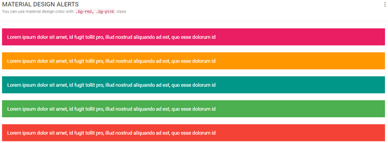
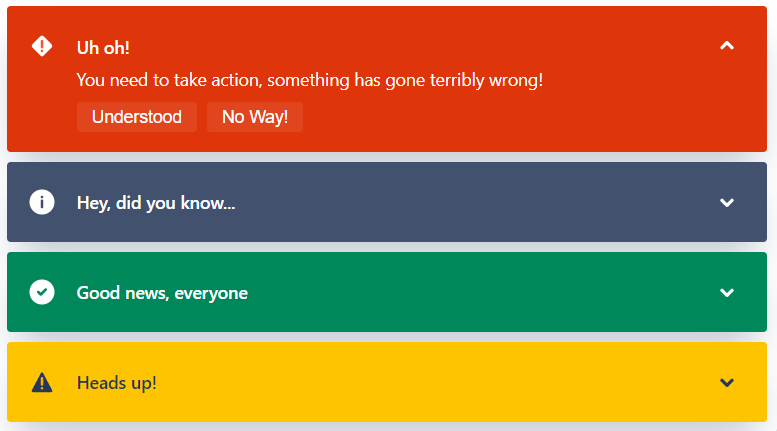

Web accessibility is not just an afterthought of web development. This is something you've to do as you create content, pages and applications on the web. To not think of accessibility is like discriminating people. Accessibility is making your application reach out to 100% of your user base, irrespective of their disabilities while browsing the web.

Facebook founder Mark Zuckerberg is Color blind !! How do you show your website to him ?

Yah, I know it's not very important, you can even create pages without taking care of these details. But the difference between good and great is attention to detail. 

### So what are some of the excuses that we make to avoid taking care of accessibility?

1. **Accessibility is not cool** 😎

    Often times it is true, sometimes the fanciest UI's are not possible if we strictly stick to our accessibility guidelines. But what we should really think is that fancy UI is not always the best, it's the people who benefit from the product that matters. But if there's a way we can circumvent this, Happy to.. ([Refactoring UI](https://refactoringui.com/book/) by Adam Wathan & Steve Schoger, really gives some tips around this)

2.  **What's the impact? We don't see an immediate effect.**

People with disabilities do use the internet !! Not everyone's perfect. Accessibility doesn't just help you improve the website for them, it just improves the usability of the website for everyone.

3.  **Not sure of what to do?**

Often times, yah most of us do not even think of this while creating a website, Sometimes it's when you actually see someone struggling to use the product or coming across the Accessibility concepts on the internet that we actually think of it. It's the empathy that we should have for the users. You could get a lot of information on accessibility over the internet. You can get the general guideline here at - [Web Content Accessibility Guidelines (WCAG) 2.0](https://www.w3.org/TR/WCAG20/) 

4. **It's too hard, too much work !!**

It's true that it's hard to think of every minor detail, different use cases. But it's worth it. It is even good for business by making it accessible to everyone.

So I first started thinking about this after I saw someone colourblind, unable to identify success and failure messages on a website as they were just colour coded. One example of that could be seen here. 

*This is a really bad implementation, as users will struggle to identify at first sight.*

*Here atlaskit considers this case, so we have icons to help with understanding the content even before reading it.*

So after seeing these, i started reading up on accessibility. so as i progress i'll keep posting quick bits on accessibility. 

Enough of theory, let's talk that in detail in future. 

### So what are some of the areas that we should look for ?

1. Text readability
2. Text overlaid on background images
3. Colors, Filters etc
4. Link recognition
5. Color combinations
6. Form placeholders and validations
7. Primary Buttons
8. Alert messaging
9. Graphs

**Actually i'll put up some resources here if you're intrested in reading more on accessibility:**

1. [Designing for a color blind user](https://www.slideshare.net/TDdesign/how-to-design-for-colorblind-user)
2. [How to Meet the Web Content Accessibility Guidelines 2.0](https://amzn.to/3dhyiJv)
3. [Web Accessibility: A Foundation for Research (Human–Computer Interaction Series)](https://amzn.to/2zyLriY)
4. [Accessibility category on medium](https://medium.com/topic/accessibility)

Adios for the day 👋