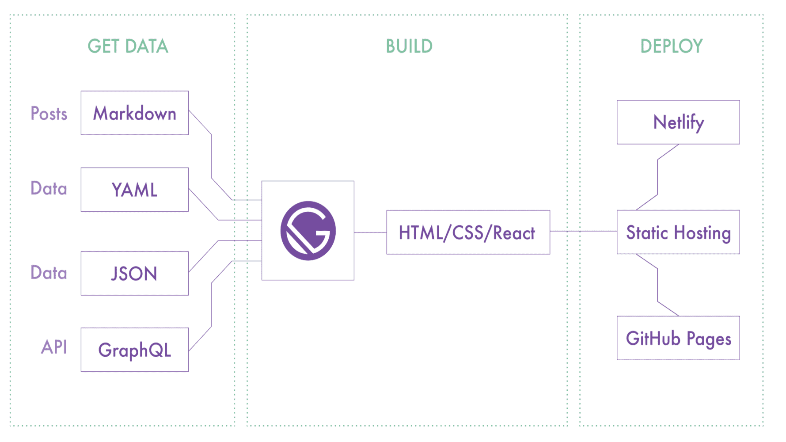
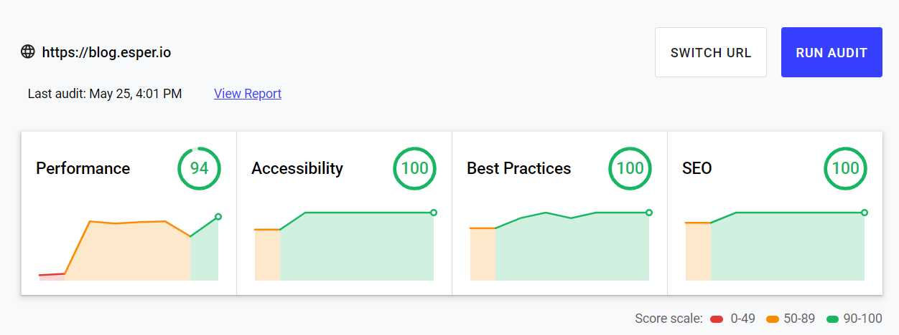

First thing, I would like to give a shout out to entire Gatsby team for developing such a beautiful framework. Just makes life much simpler when you want to create a website, blog, app or you name it. 

Gatsby is one of the best frameworks that I've come across in my career and has helped me a lot. It's sheer simplicity and quality is what impresses me. The whole concept of JAMStack is accelerated by frameworks like gatsby. 

## How things were n the past

Long back if you wanted to create a blog, it'd be complex for you 🤯, either you'll have to stick to a CMS like WordPress, Drupal or Magento, or you'll have to go for other external providers. TBH I've been always afraid of using Wordpress to do anything, this is mainly because of the git culture. In Wordpress whatever changes you make are reflected in production by default, and this is a huge problem ❌, I repeat a  huge problem, You edit a small PHP file and it could bring the entire site down. and the worst part is you'll be just clueless 🤷‍♀️ !! Now the only option is to go back to the last known good backup, and if that's not there, you're doomed 🤯. 

So when it comes to Gatsby, you'll always be following the git development flow, where you check-in code to your master branch and build from there to make it to production. You can always test on your local, verify everything works perfectly ✅ and then check-in your code. Build the code, push to production. Life is so much simpler, you can confidently make changes 😎. 

Now Another issue was the whole running a server for a small blog If you wanted to create a blog. You create a WordPress server on which the content and the site resides. Now you've to maintain the server always, guarantee 100% uptime. Which is again costly 💰💰 and waste of resources. For every user visit, we make an additional query to fetch the blog post from the DB, create and serve the files to the customers. This also creates additional issues that might compromise the security on your page. This is just absurd when it's just ~100 static blog post that you are having in your blog. 

Concept of JAMStack simplifies the whole thing by creating the static files during the build time and hosting that static at someplace on the internet 🌐. Why go through all the hosting issues, when you can just put your static pages in a GitHub repo, or a storage bucket and make it available to everyone on the internet, it's much safer and simpler. 

## Should the writer be a tech wiz ? 🤔

Now with the above approach, the main issue is who creates the content If it's not the developer ? 

**isn't it a nightmare for content creators?**

Yes, it is... Here comes gatsby to the rescue ⛑️. Gatsby can source the content from various places during build time to create your perfect website. Your source can be just a text file, CSV or markdown files. It could even be from google sheets, airtable, various API's,  Literally any source that you can think of. 

Now the content creator can peacefully create content in their favourite place, gatsby developer can just take that from there. Developers are also happy because they can develop in peace, with full freedom (Unlike WordPress), They can write CSS, use any of the libraries from npm. It's a win for the developer too. 

At Esper our website was built using Gatsby, That time we picked gatsby just for its sheer performance 📈 and SEO Capabilities, Out of the box gatsby provided 💯 Lighthouse scores, we just have to use gatsby in the optimal way (Just make sure not introduce shit ton of JS). But later with blog, we started with wordpress, but the development time taken for the same was just too much compared to what we could achieve with gatsby. 

I was accustomed to coding the website rather than setting it up on WordPress. So for me coding was much simpler than going to hundreds of options to set up the page. Plus the performance was also not very good. This was completely changed when over the weekend, when     we decided to switch to gatsby which would build the page with source as Wordpress. Now the pages are super fast & even better the development is blazing fast !!🏎️

You can see from the above image, the drastic improvements📈 after switching to gatsby. Try out gatsby for your static pages, blogs, etc and it will surprise you, how much better your life becomes. I can bet on that 

This very blog is built using gatsby, actually on top of an existing template, [Gatsby starter blog](https://github.com/gatsbyjs/gatsby-starter-blog).  It literally took me 10-15 mins to set this up. And additional time in customizing & personalizing the blog. Hosting it on Github pages & CI/CD using GitHub actions. 

This maintenance of this blog costs me literally **$0** (*Not considering the domain charges*), thanks to GitHub for their free services ([Github actions](https://github.com/features/actions) & [Github pages](https://pages.github.com/)).