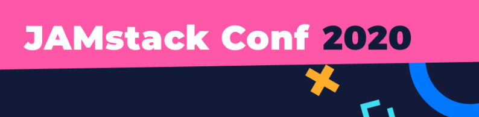
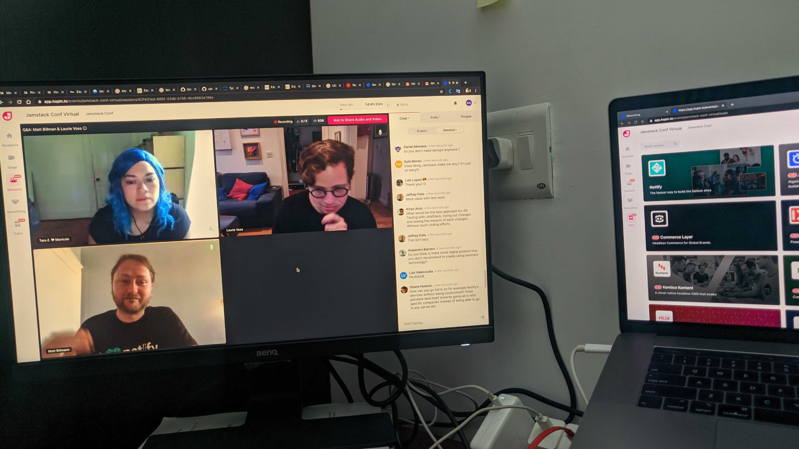
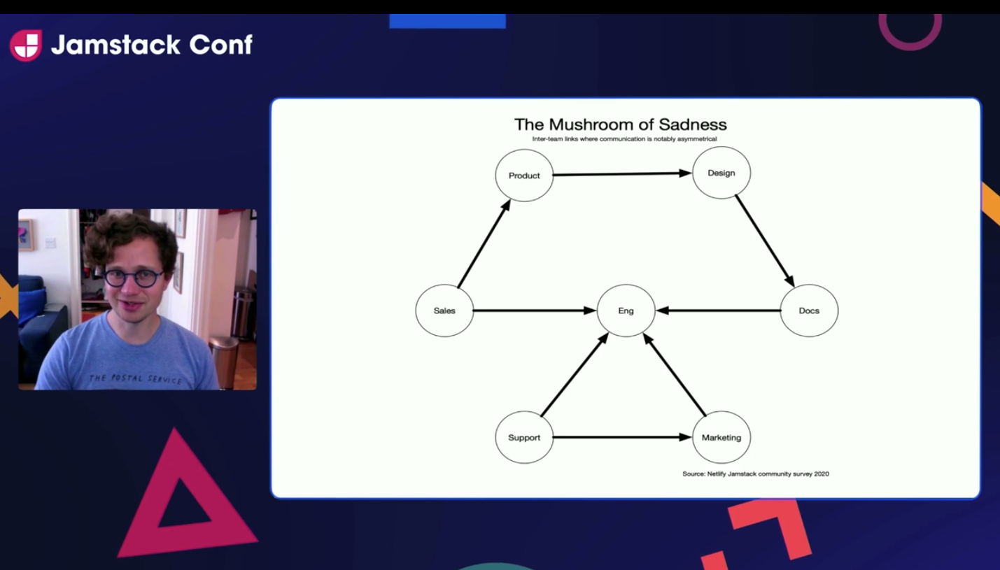

Super hyped about the JAMStack Conf that's happening right now !! 🤩

This is a great initiative. I've been thinking of attending this for a long time, But I guess this is the time I could actually attend this. For those of you who don't know what I'm speaking about, here it is.

Jamstack Conf is a two day celebration of the next generation of web apps, where the Jamstack community and ecosystem come together to learn, connect and create. Attendees range from front end and full stack engineers to web agencies all ready to push the boundaries of tomorrow’s web architecture.

It's been a few hours into this conference so far, and this has been a lot interesting so far. We have the keynote from Matt Biilmann, CEO Netlify, where he spoke about how the internet is moving towards the whole concept of JAMStack. 

 
Here's me attending this event online. 

Some of the key takeaways here that are thought provoking is that. 🤔

- How we can better focus on building websites and product instead of spending time building the infrastructure.
- What can we ensure that the best practices are often common practices?

Also, there's a book that caught my attention. This one I'm definitely going to read.
[Accessibility for everyone - Laura Kalbag](https://www.amazon.com/Accessibility-Everyone-Laura-Kalbag/dp/1937557618)

Next was a session by Laurie Voss (@seldo), Senior data analyst, where He went through various Trends in the whole internet over the last few years, and how JAMStack influences the same.Also one key focus was accessibility. 

This was a completely new experience for me, How they organized the whole conference through this online platform called [hopin.to](http://hopin.to). Here we have different stages, sessions, networking area and expo area. This closely relates to the realworld meetups.The Networking session was really cool, It's a fun area where you could meet more JAMStack buddies. We can have our ideas validated by similar folks, interacting with similar folks across 125+ countries, we would have a really good idea of how people use the tech, what are the popular tech.

Next was a session on JAMStack in emerging markets. Where how JAMStack matters for entering emerging markets. So apparently it seems that it is a common saying that

> If it works in Africa, It works everywhere.

This was a surprise for me as we used to hear a similar one, which is 

> If your startup survives in india, it'll survive anywhere.

But it looks like the above statement is quite true, The African countries have one of the worst-case scenarios for an App or a web app. The internet is pretty slow there and adding to that the internet costs are also higher comparing to other regions. To add to this the average income of people are also really low, close to 120 USD. So the internet is one of the last things they worry about.

So if we optimize our apps or website to even work on slowest internet speeds. It would work anywhere, aah it's more of a common sense 😂. But this is not often followed in most products. 

Will keep you guys posted with the good stuff from the JamStack Conf 2020 👋