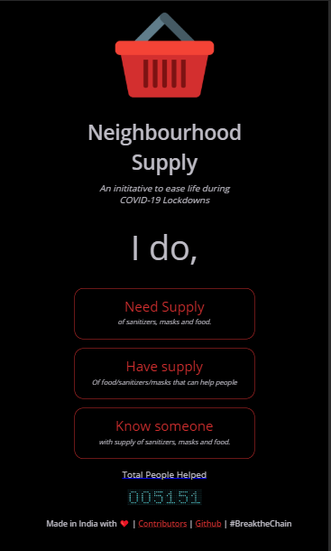
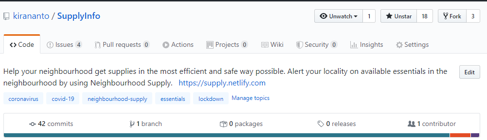

Lately, I've been picking up lot of mini side projects for fun. I'm happy that one among those has made it to headlines 🎉. Neighbourhood supply (https://supply.netlify.app) was a fun project, this was developed in response to COVID-19 🦠 Lockdowns, it was originally created when there was a shortage of 🧼 sanitizers and 😷 masks, and people were just panicked over shortages in general. 

The whole idea was to create a platform where the public could help each other by mentioning the availability of the essential items in their neighbourhood. It worked based on public data, It grows based on the data fed by the public. I was thinking of a mobile app at first thought but later decided to create a web app, which was far easier for me to create based on my skillset. 

I was not patient, I wanted to create something as soon as possible, but then I was still thinking 🤔 about this app, how could it help the public? How could I make something that everyone can easily understand? The first step I tried ✏️ sketching the whole idea onto paper. I wanted to create something very simple to understand and use, Something very simple and fast to implement. With those two concepts, I tried asking myself questions, 

*What is the motivation for someone to use this app?*

*How can I make it simple that people without technical knowledge also can understand this?*

*Even if I make something good, how do I deliver it to the masses?*

*What would be a motivation for someone to add details over here ?*

*What is the best way to go about this ?*

*What is my fastest way to bring it live ?*

Some of these questions i didn't have answer to. So with my whatever, i'll still do it attitude, i started drawing wireframes for the app,  For simplicity i just added two buttons in the homepage, a covid emoji as icon, and that's it. And first page was a form where i could fill in the information about the resource i know. Next was a listing page where i could see the essential items near to me. That was the whole frontend i created on react 😂 for this app.  

Now I wanted to create a backend where I could just store some information on the listings, and retrieve those based on proximity to the person querying the data. I knew that [firestore](https://firebase.google.com/docs/firestore) supports geospatial queries 🌎. So I quickly opened google, started searching for ways to query the same, as every developer does. Most of the results pointed to a library called [Geofire](https://www.npmjs.com/package/geofire), that helps store the data in [firestore](https://firebase.google.com/docs/firestore) as I wanted.

Without further ado I started creating my firebase project, linking it to my react code, creating Forms that talked to the [firestore](https://firebase.google.com/docs/firestore) backend 🔥. In the form, I asked place name, address, phone number and location I took from the browser location. Once that was ready I was kinda happy. Now I started making the second screen where I retrieve the information. I wanted to create cool cards, so the first thing I started was sketching the cards on paper. There are just scribblings on paper ✍️ and then direct code, nothing in between 😂. 

Now that the listings were also ready. It was almost time to call it a day 😴💤. So I stopped further development, deployed it to my personal netlify account. Got the link 🔗, Now I wanted to see what others think of the same. so I started sharing the link with my colleagues and college buddies. I just shared the link without any context and said that it's a personal project, and wanted to hear what they think it is, what is their suggestion. The first day ends there

You must be really lucky to have such good supporting colleagues and friends 😊, Now I got a lot of replies from what I've shared. To my surprise, most of them quite easily understood the whole thing. Even non-techie friends and family got it. I was happy then, Along with that, I got quite a lot of suggestions on improving that, which was like a super bonus. Now as we proceed to Day 2 I started by enhancing the previously ugly looking but functional UI, based on the handpicked good suggestions.

I wanted to do something better. Do something different. I fancied the whole concept of Conversational UI 💬. But I didn't want to go that further. I thought why not have a concept near to that. So I started thinking around those lines. Suddenly something struck. Why not have it as a question and answer instead of just 3 buttons on the homepage. I was just overjoyed with that. Yah I started trying it out. Then I later changed it to three sentences.

1. I do need supply of sanitizers, masks etc
2. I do have supply of sanitizers, masks etc
3. I do know someone who have supply of sanitizers, masks etc

Yah that identified the three types of people visiting my app. Now it was much simpler, I quickly implemented what it is right now. And started enhancing the listing page. One choice I made was that I'll never be using custom icons in this. I just wanted to leverage the universal icons we already have and is free to use. We see it very often, It's right in front of us. The EMOJI, Yah I thought why not use them instead of icons. So I gave it a try. Now Day 2 is also nearing an end, and the app is also almost completed. 🤏

#### What's left now?

I was picking the location from the users browser location, so i need to give them an option to pick different location. 📍 

I wanted to make sure that no one uses vulgar language in the platform (It's not possibile to have moderation at that point) 🥴

I wanted to make sure that it worked on all platforms.  

Now, this is where friends come in, I pushed the code live, posted it on Github, shared it with friends, asking for help. Got a lot of help in checking if it works in their mobile phones. 

-  My friend and colleague Fawaz (Also My Teammate, a Superb React Dev, Esper) offered to help in changing the user location to the custom location they pick from the internet. 

- Sahana (from the Marketing team, Esper) was kind enough to use the entire app, give suggestions and changes that were required to make it better. she also helped in creating share messages that I sent across on WhatsApp. 

- Nikhil Vijay (College Friend & Ex Roommate) helped in thinking about the use of the app by common people. 

- Neha (From marketing team, Esper) who helped in spreading this app and delivering it to the people. 

- Phani (Sales Team, Esper) & Karan (CEO T6Solutions) For help in publicising and sharing it with various crowds. There were a lot of other helps too. 
- Plus really good support from Yadhu (CEO Esper) & Shiv (COO Esper). 

In the next 2-3 days, we polished the entire UI, made it good enough to be used by people. Tested it across a set of people for feedback. everything went good. Now it was time to launch this 🚀. 
Our whole idea was a viral approach through Whatsapp which was quite successful in the beginning. Later the app got exposure through offline and online media. We had over 5000+ users, 18 stars on github.

#### Couple of things that surprised was

1. One of the largest recruiting companies in india got inspired from the the whole idea of three sentences, and was using the same one in their new covid response page. 
2. Got my name mentioned in thehindu 😍
3. Made my mom understand that i'm not just wasting my time infront of laptop 😂

But again slowly the need for this app faded as we went through different phases of lockdown and things started getting better. But that was a really good journey. 