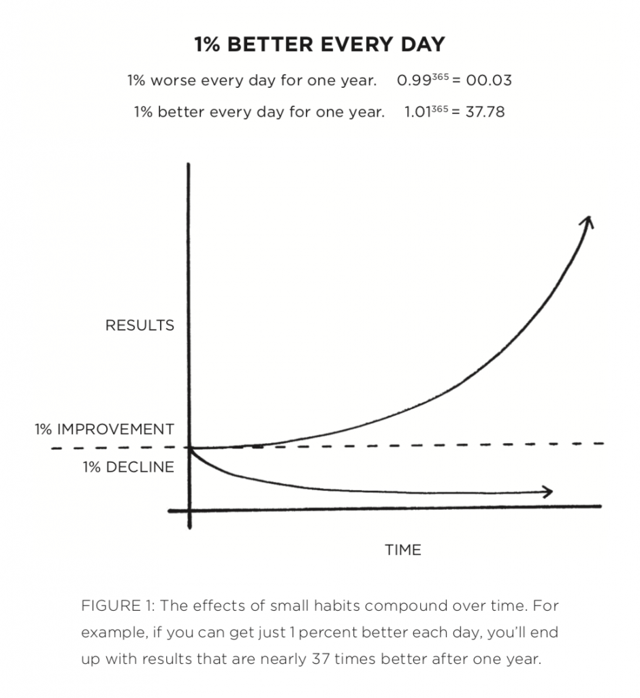

Today, as a holiday it's an even better opportunity to start working on my long-awaited personal project. The 1 Percent blog 🎉.

Well, I've been thinking about it lately. All the new experiences all the new learnings, I think we grow along with everyone as we share our experiences.I would be posting/sharing the problems that I have faced along with the decisions and solutions that I had taken, impacts of those.  

There's a book that had left a long-lasting impression on me, [Atomic Habits by James Clear](https://amzn.to/2Txs40d). His principle of 1 per cent improvement really made a spark, almost like an enlightenment.  The changes might be really small to be noticed, but when accumulated over time, it can be drastic in nature. 

The image above explains how you as a person either improves or worsens based on what you do daily. This will be a major theme of my blog, hence i'm naming my blog as 1percent Blog. This is my journey to improve 1% everyday, I'll be blogging throughout my journey to be on track.